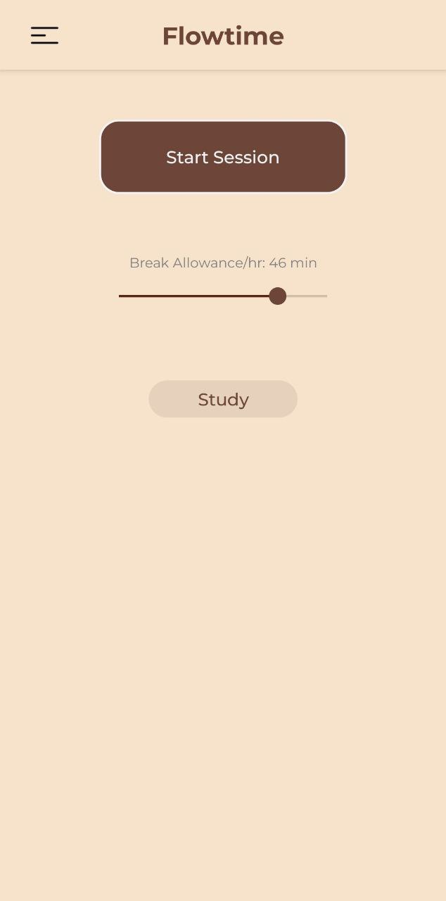
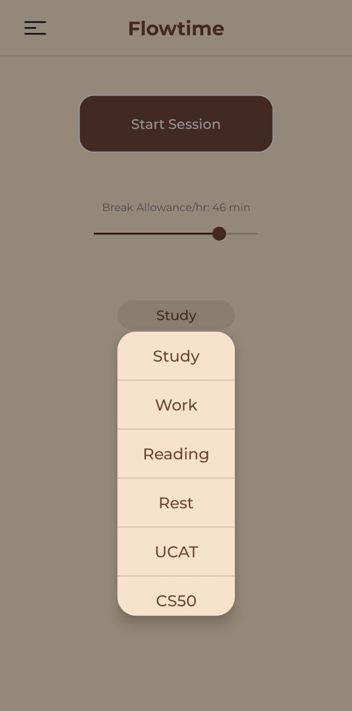
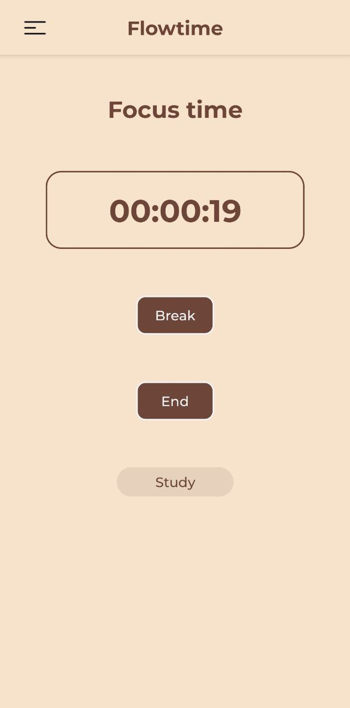
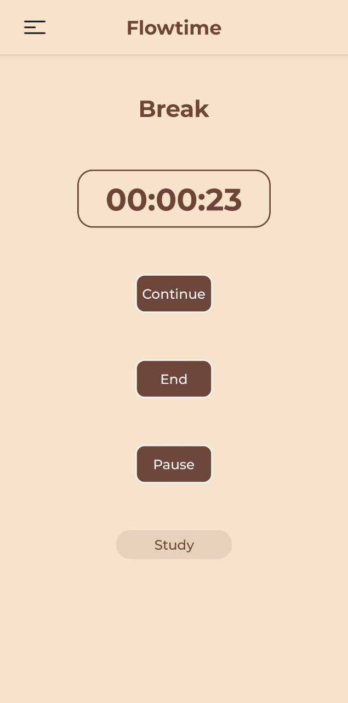
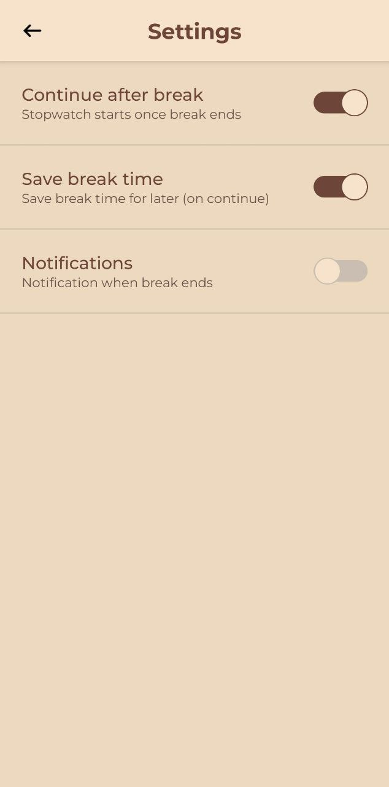
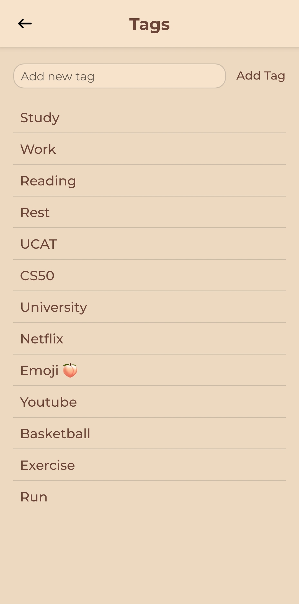
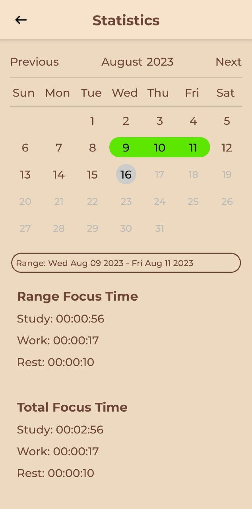
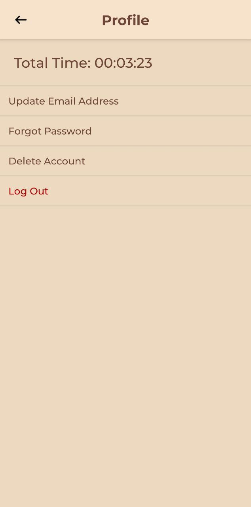

# Flowtime
My name is Jian Ron and this is my CS50 final project!

Video Demo: [CS50x Final Project Flowtime]()

## Features:
* Framework: [React Native](https://reactnative.dev/docs/getting-started)
* State Container: [Redux](https://redux.js.org/introduction/getting-started)
* Database: [Firebase](https://firebase.google.com/docs)

## Overview:
Flowtime is a mobile application that is used for the purpose of productivity. This app was inspired by the Flowtime technique, 
an adaptation of the popular Pomodoro technique, read more about the Flowtime focus technique [here](https://zapier.com/blog/flowtime-technique/).

### Description:
Flowtime allows the user to set their own ratio of break time to focus time and how ever long the user decides to focus, the
ratio will be used to calculate the time that the user will get to take a break. The user can also change in settings the
behavior of the break timer, to continue automatically once break timer ends or otherwise, to not save or save their break
time for later should they decide to end their break early, to turn on notifications for when their break ends, as well as
set tags to track what they focused on. Users can also see their study time in the Statistics page and also manage their
account, delete their account, change their email and password, and log out.

### Screenshots:

| Screenshots | Description |
|-|-|
|  | This is the homepage, the user can adjust the "Break Allowance/hr" to choose how much break time is given to the user per unit time focused |
|  | The user can change the focus tag to track different tasks or work |
|  | The timer page, the user can see how long they focused on the timer and this will be the page they will be on while focused, when the user wants to take a break they can press break or if they want to end the session, they can press end |
|  | The break page, the user will be given a time to take a break based on how long they focused and the break allowance they set for themselves, the user can also choose to continue or end the session |
|  | The settings page, the user is able to configure their preferences for how the app functions and enable or disable notifications |
|  | In this page, the user can add tags or remove tags by holding down on any tag |
|  | The statistics page, the user can select any range of dates to find out how long they focused for each tag and this page also displays the total time focused for each tag |
|  | The profile page, the user is able to manage their account from this page and also see their total focus time |

### Design Choices:
<table>
  <tr>
    <td>React Native</td>
    <td>The decision to use React Native as the app's framework was driven by the extensive community support and its simplicity in allowing cross-platform support.</td>
  </tr>
  <tr>
    <td>Redux</td>
    <td>Initially, I didn't actually want to use Redux as I felt that the project was not large or complex enough to warrant putting in time and effort implementing Redux throughout the app. However, as I begun to implement my settings page, I realised that it would be rather useful and could even reduce the complexity in my code by utilizing Redux as it provides a way to cleanly manage the state of the different settings and make it much easier to pass state between different pages, especially between pages in different stacks (HomeStack and the drawer navigator NavStack). Redux is also used in conjunction with Firebase Firestore to store information about the users tags, and also used for storing saved break time (which can be turned on/off in the settings page). Overall, Redux made managing my app's state simpler, proving a centralized state management solution, as well as making debugging and dataflow more transparent.</td>
  </tr>
  <tr>
    <td>Firebase</td>
    <td>The decision to choose Firebase was rather clear. Firebase provides us with 2 crucial features, Firebase Authentication and Firestore Database, both of which integrates seamlessly with React Native, and in part, with Redux, allowing us to implement user authentication, and in turn, store user data. Firebase's powerful querying capabilities were also found to be useful in getting the data for the statistics page. Firebase provided a scalable and real-time database solution without the need for backend infrastructure.</td>
  </tr>
</table>

## Explaining The Files:
| Screens | Description |
|-|-|
| about.js | Page explaining the app and about this project (incomplete)|
| break.js | This is the break timer page and in this page, settings are fetched, notifications handled, the break time is calculated, and a timer is starts counting down when the page opens |
| home.js | Front page, fetches saved settings from firebase and dispatches to redux, user can start focus time, adjust break time to focus time ratio, and change their focus tag |
| homestack.js | Contains navigation for the homestack, which contains the home page, focus page, and break page |
| navstack.js | Contains navigation for the homestack and drawer components, helps with loading the fonts for the app once logged in |
| profile.js | Allows the user to manage their profile by changing their email, password, deleting their account, or logging out, additionally also shows their total focus time on the app |
| settings.js | Page containing toggles that the user can use to adjust the behavior of the app as well as set notification preferences |
| statistics.js | Page where the user can look at their focus time by selecting dates from a calendar, which will be grouped by the tag |
| tags.js | Page where users can remove or add tags, listing down all the tags that they have |
| watch.js | Page displays a stopwatch and tracks the user's focus time and tag and updates to firebase |
| forgotpassword.tsx | Page where user can enter their email and a link will be sent to their email so they can reset their password |
| signin.tsx | Sign in page managed by firebase authentication |
| signup.tsx | Sign up page managed by firebase authentication |
| welcome.tsx | Welcome page which leads to signin.tsx or signup.tsx |

| Root | Description |
|-|-|
| app.config.js | Expo configuration file, includes settings for ios and android and extra configurations for EAS and Firebase |
| App.js | Entry point for the app, wraps the root navigation component with Redux provider to provide global redux store to app |
| babel.config.js | Configuration for Babel, a JavaScript compiler. Includes presets and plugins used by my app |
| eas.json | Configuration for EAS Build and EAS Submit, includes settings for different build profiles and environment variables for my EAS Build |
| index.js | Imports the entry point for the router in your project. Used to start your app |
| package-lock.json | Automatically generated by npm, describes the exact tree that was generated when npm install last ran |
| package.json | Contains list of dependencies required by the app |
| tsconfig.json | Configuration for TypeScript compiler options for the app |
| config/firebase.ts | Initializes Firebase, creates a Firebase App object with the Firebase project configuration and exports it along with a Firestore database instance |
| utils/hooks/useAuthentication.ts | Contains custom React hook that manages the user's authentication state by setting up a listener for changes in the user's sign-in state and updates its local state accordingly |

| Redux | Description |
|-|-|
| actions.js | Contains action creators, functions that return an action where each action has a type and a payload. |
| reducers.js | Contains reducers, which are functions that take the previous state and an action, and return the next state |
| store.js | Creates the Redux store, which brings together the state, actions, and reducers, and adds thunk middleware to the store |

| Navigation | Description |
|-|-|
| authStack.tsx | Contains navigation for the authentication pages, signin, signup, and welcome |
| index.tsx | Contains code where if the user is logged in, NavStack will be shown, else, AuthStack will be shown for user to log in or create a new account |

| myComponents | Description |
|-|-|
| .style.js files | Files containing the styles for different components and pages |
| .jsx files | Files containing components that will be used in screens, e.g. sliders, switches, dropdown menu, etc. |
| index.js | Exports components and styles to be easily imported in other pages |

| Constants | Description |
|-|-|
| icons.js | Imports icons from the asset file |
| index.js | Exports icons and theme constants for easy use in other pages |
| theme.js | Contains common colors, sizes, fonts, and shadows for use in other pages |

### Try it out yourself:
Download the Expo Go app on [Android](https://play.google.com/store/apps/details?id=host.exp.exponent) or [IOS](https://apps.apple.com/sg/app/expo-go/id982107779) and copy the links into your browser to test.

Android: exp://u.expo.dev/update/1907350e-9c79-4d98-a358-3bc4c3722d3f

IOS: exp://u.expo.dev/update/e68e1a21-d9f2-45ff-a566-9268771531c3

## Conclusion:

### Future Improvements:
Some future improvements could include implementing more ways to look at the user's data in statistics, perhaps by adding in a bar or pie chart to better visualize data. There are also certain improvements to be made to user experience, for example the switches and the user's slider value taking time to load when the page first opens and the sign up page appearing every app start up before the user is automatically logged in.

Additional features in future updates could include a friend system where users can add friends and check how long their focus time was. Another feature could be streaks where if the user focuses for at least 10 minutes a day, that counts as extending the streak and these 2 features can better incentivize users to focus and complete their work. Lastly, adding a page where the user gets a list of their sessions and also be able to edit their focus time start and end so the user has more control over their statistics and is able to edit any wrong entries accordingly.

### Project Takeaways:
Overall, building this app has been a fun and fulfilling experience, and though it took much time and effort, the CS50x course has been an enriching experience and has been a great introduction to computer programming for me personally, and I would definitely recommend it to anyone wanting to start their journey as a software engineer. I went through much hardship and frustration to get to this point, and having finally completed my app, I felt a great sense of satisfaction and achievement, and I hope to go on to do greater and better things in my programming journey.
